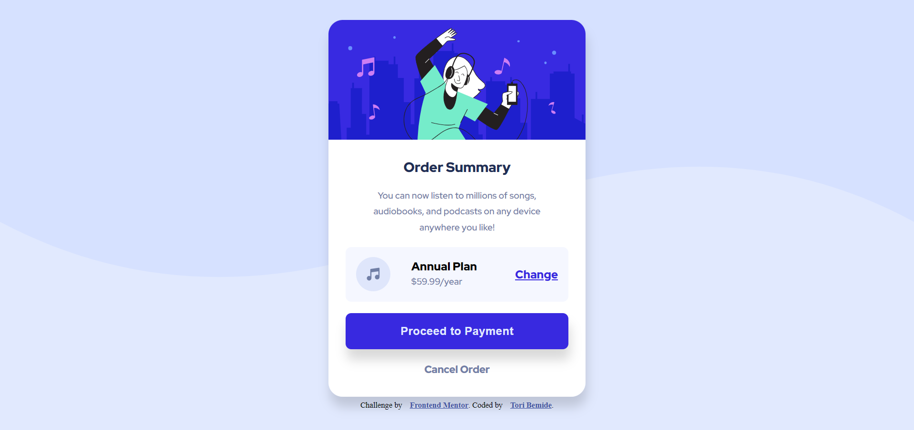

# Frontend Mentor - Order summary card solution

This is a solution to the [Order summary card challenge on Frontend Mentor](https://www.frontendmentor.io/challenges/order-summary-component-QlPmajDUj). Frontend Mentor challenges help you improve your coding skills by building realistic projects. 

## Table of contents

- [Overview](#overview)
  - [The challenge](#the-challenge)
  - [Screenshot](#screenshot)
  - [Links](#links)
- [My process](#my-process)
  - [Built with](#built-with)
  - [Useful resources](#useful-resources)
- [Author](#author)
- [Acknowledgments](#acknowledgments)

## Overview

### The challenge

Users should be able to:

- See hover states for interactive elements

### Screenshot

### Links

- Solution URL: [HTML Solution](https://github.com/Tori-Bemide/Frontend-mentor-order-summary-component/blob/main/index.html)
- Solution URL: [CSS Solution](https://github.com/Tori-Bemide/Frontend-mentor-order-summary-component/blob/main/css/styles.css)
- Live Site URL: [Live Site] (https://tori-bemide.github.io/Frontend-mentor-order-summary-component/)

## My process

### Built with

- Semantic HTML5 markup
- CSS custom properties
- Flexbox
- Mobile-first workflow

### Useful resources
- [HTML&CSS Tutorial and Projects Course (Flexbox&Grid) By John Smilga](https://www.udemy.com/course/in-depth-html-css-course-build-responsive-websites/) - This course is really good. Recommend for anyone interested in improving their html and css skills.

## Author
- Frontend Mentor - [@Timony](https://www.frontendmentor.io/profile/Tori-Bemide)
- Twitter - [@TBemide](https://www.twitter.com/TBemide) 